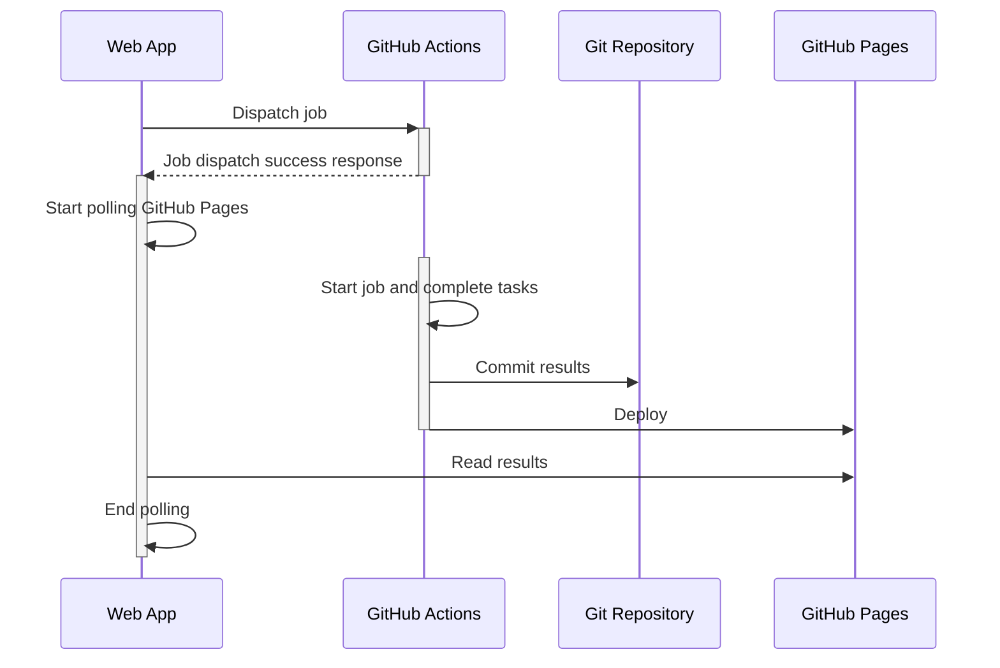

# GitHub Actions webhook sample

You can dispatch workflow by curl like this.

```bash
curl \
  -L \
  -X POST \
  -H "Accept: application/vnd.github+json" \
  -H "Authorization: Bearer <YOUR-TOKEN>" \
  -H "X-GitHub-Api-Version: 2022-11-28" \
  https://api.github.com/repos/OWNER/REPO/dispatches \
  -d '{
  "event_type": "test_result",
  "client_payload": {
    "passed": false,
    "message": "Error: timeout"
  }
}'
```

You can create the token from here. [Fine-grained Personal Access Tokens](https://github.com/settings/tokens?type=beta)

The event_type need to be same as types in workflow definition.

(From [`.github/workflows/webhook.yml`](./.github/workflows/webhook.yml)
```yaml
on:
  repository_dispatch:
    types: [test_result]

jobs:
  run_if_failure:
    runs-on: ubuntu-latest
    steps:
      - env:
          MESSAGE: ${{ github.event.client_payload.message }}
        run: echo $MESSAGE
```

## Response handling with GitHub pages

The above method can not return results.
I use the result file in this repo and the job write the result and commit, then GitHub Action deploys it to GitHub Pages.

This sample deploys ./docs directory. (configured in repository settings)

```yaml
# need this permission to push
permissions:
  contents: write

jobs:
  run_if_failure:
    ...
    steps:
      - id: update_response
        name: Update response
        env:
          MESSAGE: ${{ github.event.client_payload.message }}
        run: |
          # some other task here
          [ ! -d docs ] && mkdir docs
          # output results in docs directory which will be deployed to GitHub Pages
          echo '{"message": "'$MESSAGE'", "date": '$(date "+%s%3N")'}' > ./docs/response.json
      # git committing sample from https://github.com/orgs/community/discussions/25234#discussioncomment-4026272
      - id: commit_files
        name: Commit files  
        run: |
          git status
          git diff
          git config --local user.name actions-user
          git config --local user.email "actions@github.com"
          git add docs
          git commit -am "GH Actions Workflow has dispatched at $(date)"
          git push -f origin main
```

The sample sequence is like this. Sample web page is also in [./docs/index.html](./docs/index.html).



## References

- [Events that trigger workflows - GitHub Docs](https://docs.github.com/en/actions/using-workflows/events-that-trigger-workflows#repository_dispatch)
- [REST API endpoints for repositories - GitHub Docs](https://docs.github.com/en/rest/repos/repos?apiVersion=2022-11-28#create-a-repository-dispatch-event)
- [Webhook events and payloads - GitHub Docs](https://docs.github.com/en/webhooks/webhook-events-and-payloads#repository_dispatch)
